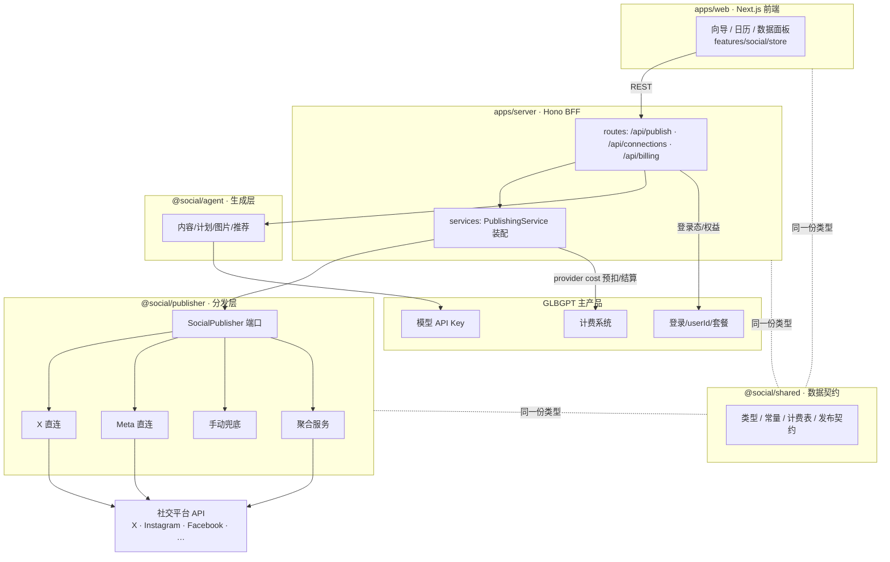
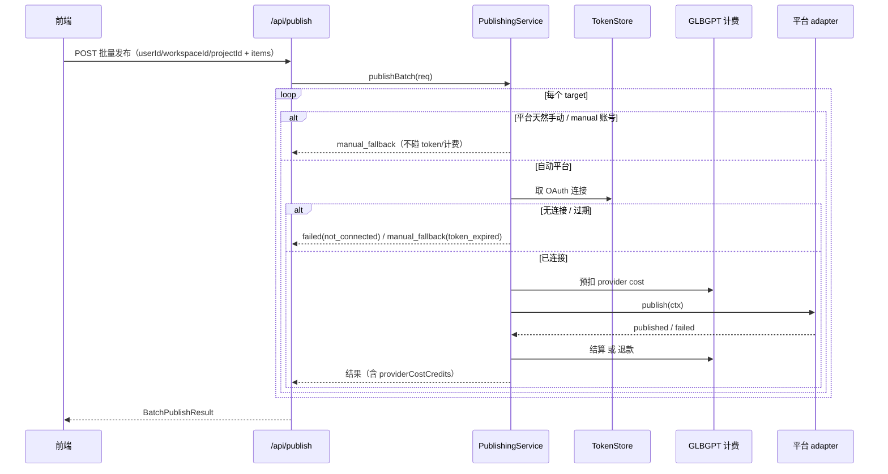

# Super Social Agent（social-agent-ts）

> **嵌在 GLBGPT 里的社媒 Agent 工具**：帮海外社媒运营 / 创业者 / 自媒体，走完「品牌上下文录入 → 内容计划 → 文案·图片素材生成 → 多平台适配 → 排期发布 → 运营数据复盘」的闭环。
>
> 复用 GLBGPT 的登录、用户身份、套餐权益、计费系统与模型 API Key——不是独立产品，而是 GLBGPT 的一个能力入口。

- 需求 Spec：[`docs/super-social-agent-requirement-spec-p0.zh.md`](docs/super-social-agent-requirement-spec-p0.zh.md)
- 架构决策：[`docs/superpowers/specs/2026-07-09-social-agent-monorepo-architecture-design.md`](docs/superpowers/specs/2026-07-09-social-agent-monorepo-architecture-design.md)
- 发布集成 & 成本：[`docs/social-platform-publishing-integration.zh.md`](docs/social-platform-publishing-integration.zh.md)

---

## 目录（monorepo）

pnpm workspace + Turborepo，前后端彻底分离、共享一份数据契约：

```
social-agent-ts/
├─ apps/
│  ├─ web/         ★ Next.js 前端（产品原型的干净重构，完整可跑）
│  └─ server/      ○ 后端 BFF（Hono）：代理 GLBGPT + 领域服务 + 发布/agent 编排
├─ packages/
│  ├─ shared/      ★ 跨前后端契约：领域类型 + 枚举常量 + 计费表 + 发布契约
│  ├─ publisher/   ★ 发布 / 分发层：SocialPublisher 端口 + 各平台 adapter + 发布编排
│  └─ agent/       ○ 生成能力编排层（内容/计划/图片/推荐）——占位待接 agent 框架
├─ docs/           需求 spec、架构与集成文档
├─ references/     参考仓（yanfa-*，只读参照，勿改）
└─ pnpm-workspace.yaml · turbo.json · tsconfig.base.json

★ = 已落地   ○ = 脚手架/占位
```

### 模块职责

| 模块 | 包名 | 职责 | 状态 |
|---|---|---|---|
| `apps/web` | `web` | Next.js 前端：Onboarding、Home、Brand Profile、Account Hub、Content Create 向导、Calendar、Operations Data。状态在 `features/social/store`，数据源目前是可替换的内存 mock。 | 完整可跑 |
| `apps/server` | `server` | Hono BFF：健康检查、计费表、**发布路由**、**连接(OAuth)脚手架**。定位是 GLBGPT 的 BFF，非独立重后端。 | 脚手架 + 发布层 |
| `packages/shared` | `@social/shared` | 前后端**唯一数据契约**：`Platform`/`SocialPost`/`PostVariant` 等领域类型、`CREDIT_COSTS` 计费表、`PLATFORM_CAPABILITIES` 与 `PublishRequest/PublishResult` 发布契约。 | 已落地 |
| `packages/publisher` | `@social/publisher` | **真实发帖的分发层**：把"发到某平台某账号"抽象成 `SocialPublisher` 端口，X/Meta 直连、TikTok/YT/Reddit 手动兜底、聚合服务可选，`PublishingService` 统一编排（路由/连接/计费/结算）。 | 已落地（待联调凭证） |
| `packages/agent` | `@social/agent` | **生成层**（`publisher` 的姊妹包）：内容变体、7 天计划、图片生成/修改、运营推荐的统一入口，模型走 GLBGPT 模型层。 | 占位 |

---

## 职责边界：本项目自建 vs 需联调

Super Social Agent 是"嵌在 GLBGPT 里的工具"，不是独立产品。所以有意把**自己造的东西**和**要靠外部系统的东西**用接口（seam）切开——外部的部分本项目只留标准接口、不自己乱造。

### 一、本项目（social-agent-ts）自己负责、自己造

- **全部前端**：UI、交互、向导、日历、状态管理（`apps/web`）。
- **后端 BFF 骨架与领域服务**：路由、参数校验、发布编排、连接编排（`apps/server`）。
- **数据契约与业务规则**：领域类型、平台能力矩阵、发布契约、计费口径表（`@social/shared`）。
- **发布层的编排与适配逻辑**：`SocialPublisher` 端口、各平台 adapter 的**请求构造 / 结果映射 / 路由与手动兜底规则**、`PublishingService` 的预扣→发布→结算/退款流程（`@social/publisher`）。
- **生成能力的编排入口**：`@social/agent`（调用逻辑本项目写，**模型本身走 GLBGPT**）。
- **自有数据的存储**：品牌信息、帖子、素材等表结构由本项目设计（扣费相关表除外，见下）。

### 二、需要和外部系统联调（本项目已留接口，等对方提供）

本项目在每个外部依赖处都留了明确的 seam（接口/装配点），联调=把对应实现填进去，其余代码不动：

| 外部系统 | 本项目已提供（seam） | 对方需提供 | 落点 |
|---|---|---|---|
| **GLBGPT 登录/权益** | BFF 消费登录态的位置 | userId / 登录态 / 套餐权益校验 | `apps/server`（鉴权中间件待接） |
| **GLBGPT 计费系统** | `BillingGateway` 接口（预扣/结算/退款）+ 调用时机 | 计费 API + **美分→credits 换算率** | `apps/server/src/services/publishing.ts`（现为报错桩） |
| **GLBGPT 模型层** | `@social/agent` 生成入口 | 模型 API Key / 模型调用链路 | `packages/agent`（占位） |
| **`references/yanfa-chatpal-api`** | 计费口径 `CREDIT_COSTS` | **扣费相关 DB 表结构**（须先读它、对齐再建表） | DB schema 阶段（勿提前动） |
| **各社交平台 API（X/Meta…）** | 各平台 adapter 的真实请求已写好 | OAuth app / client_id / 凭证 / App Review | `@social/publisher` adapter + `TokenStore` |
| **或：聚合服务（可选）** | `AggregatorPublisher` 已写好 | 服务商 apiKey / 账号 profile 映射 | 环境变量 `SOCIAL_PUBLISH_MODE=aggregator` |
| **账号 OAuth token 存储** | `TokenStore` 接口 + 调用时机 | 连接账号时写 token、发布时读+刷新 | `apps/server/src/services/publishing.ts`（现返回 null） |

> 一句话：**"发帖内容怎么生成、怎么适配、怎么路由、失败怎么处理" 是本项目的活；"用户是谁、余额扣哪、模型谁跑、token 存哪、平台准不准发" 要靠 GLBGPT 和各平台联调。** 详细联调步骤见 [`docs/social-platform-publishing-integration.zh.md`](docs/social-platform-publishing-integration.zh.md) §6。

---

## 架构



**发布一条内容的时序**（`SocialPublisher` 端口把"直连 vs 聚合"藏在背后）：



设计核心（第一性原理）：**上层只依赖 `SocialPublisher` 一个接口**。换底层实现（聚合↔直连）、加平台，都只动 adapter 装配，编排/路由/前端零改动。

---

## 技术栈

| 层 | 选型 |
|---|---|
| 语言 / 包管理 | TypeScript 5.7 · pnpm 10 workspace · Turborepo · Node ≥ 20 |
| 前端 | Next.js 16（Turbopack）· React 19 · Tailwind v4（oklch 令牌）· base-ui · lucide |
| 后端 | Hono（`@hono/node-server`）· tsx（开发直跑 TS） |
| 契约 | 共享 TS 源码包（无构建步骤，消费方各自编译） |
| 测试 | Vitest（`@social/publisher` 已接入） |
| 集成目标 | GLBGPT（登录/计费/模型）· 各社交平台 API / 聚合服务 |

> 共享包（`@social/*`）刻意**不做构建**、直接暴露 `src` TS 源码：前端经 Next.js `transpilePackages` 编译，后端经 tsx 即时转译。少一层产物、契约改动即时生效。

---

## 真实发帖会收费吗？

**简答**：API 本身大多免费，**唯独 X 按次收费**（$0.015/条，带链接 $0.20/条，2026-02 起）；Meta(IG/FB) 免费但要过审核；TikTok/YouTube/Reddit 在 P0 是手动兜底、不产生自动发布成本。这些"每次自动发布的第三方成本"就是 spec 里的 *provider cost*，由后端向 GLBGPT 计费系统预扣结算。

完整逐平台成本、直连 vs 聚合对比、联调 checklist 见 → [`docs/social-platform-publishing-integration.zh.md`](docs/social-platform-publishing-integration.zh.md)。

---

## 扩展可能性

- **加一个新平台**：在 `packages/shared` 的 `Platform` 加枚举 + `PLATFORM_CAPABILITIES` 加能力，在 `@social/publisher` 写一个实现 `SocialPublisher` 的 adapter，`createPublisherRegistry` 里注册即可。上层不动。
- **直连 ↔ 聚合服务切换**：环境变量 `SOCIAL_PUBLISH_MODE=direct|aggregator`，同一 port 换后端。
- **接 agent 框架**：`@social/agent` 落地内容/计划/图片/推荐生成，模型统一走 GLBGPT 模型层，计费对应 `BillingActionType`。
- **换真数据源**：前端 `features/social` 的 mock 换成后端 API client，UI 不动（数据获取是独立 seam）。
- **落库**：品牌/帖子/素材建表；**扣费相关表须先对齐 `references/yanfa-chatpal-api` 再联调**（见项目约束）。
- **定时发布 / 重试**：`PublishResult` 已含 `scheduled` 分支，接队列/调度即可扩成真正的定时与失败重试。

---

## 运行

```bash
pnpm install

pnpm dev:web        # 前端  http://localhost:4100
pnpm dev:server     # 后端  http://localhost:8091   （PORT 可覆盖）

pnpm typecheck      # 全仓类型检查
pnpm --filter @social/publisher test   # 发布层单测
```

发布层脚手架自测（后端起在 8091 时）：

```bash
curl localhost:8091/api/publish/capabilities                 # 平台能力矩阵
curl localhost:8091/api/connections/requirements             # 各平台 OAuth 权限要求
curl -X POST localhost:8091/api/publish -H 'content-type: application/json' \
  -d '{"userId":"u1","workspaceId":"w1","projectId":"p1",
       "items":[{"target":{"platform":"TikTok","accountId":"a"},"content":{"text":"hi"}}]}'
# → TikTok 返回 manual_fallback；X/Facebook 未连账号时如实返回 failed(not_connected)
```

---

## 现状与后续

- ✅ 前端全流程可跑（原型忠实重构）
- ✅ 共享契约 + 计费表 + **发布契约/能力矩阵**
- ✅ **发布层 `@social/publisher`**：端口 + 4 类 adapter + 编排 service + 单测（10 例全绿）
- ✅ 后端发布路由 + 连接(OAuth)脚手架，端到端可打通（联调桩下如实暴露未接通）
- ⏳ 待联调：各平台 OAuth app / 凭证、`TokenStore`、GLBGPT `BillingGateway`、Meta App Review
- ⏳ 待做：`@social/agent` 生成能力、真实数据源、DB schema（先对齐 `references/yanfa-chatpal-api`）
